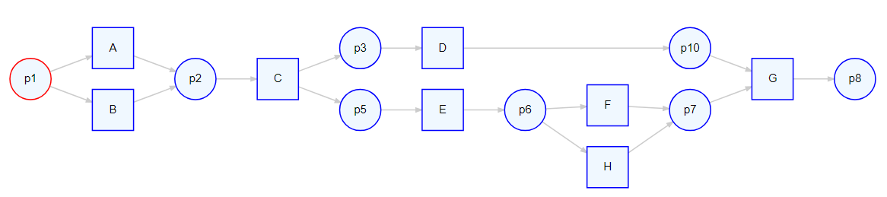

```{r setup, include=FALSE}
knitr::opts_chunk$set(echo = TRUE)
knitr::opts_chunk$set(error = T)
knitr::opts_chunk$set(tidy.opts=list(width.cutoff=80))

```

# Getting started

## Installing required packages

The following packages can be installed from CRAN using `install.packages`. Note that other core packages of bupaR, such as edeaR can be installed this way as well. However, we only install the packages required for this tutorial. 

```{r eval = F}
install.packages("bupaR")
install.packages("processmapR")
install.packages("daqapo")
install.packages("processanimateR")
install.packages("heuristicsmineR")
```

The packages logbuildR, collaborateR and propro can be installed from github, using the `remotes` installation function. 

```{r eval = F}
install.packages("remotes")
remotes::install_github("bupaverse/logbuildR")
remotes::install_github("bupaverse/collaborateR")
remotes::install_github("bupaverse/propro")
```

## Load packages

Using the `library` function, we can load the packages to use them. 

```{r warning = F, message = F}
library(bupaR)
library(logbuildR)
library(daqapo)
library(heuristicsmineR)
library(propro)
library(processanimateR)
library(collaborateR)
```

# LogbuildR

Starting from a regular R data.frame, logbuildR helps the user to go through different steps in order to prepare the data for process analytics. To start the process, you can execute the function `build_log()`. 

```{r eval = F}
build_log()
```

This will open a dialogue window that will ask you to select your data. In subsequent steps, you will be able to prepare the data by answering the questions prompted. The Figure below shows an example of the different steps that the logbuildR goes through. Of course, the specific sequence of questions and steps can be different, depending on the format of the input data. 

```{r out.width = "100%", echo = F}

```

An example of the end-to-end logbuildR workflow will be given in the accompanying screen-cast. 

# DaQAPO

The daqapo packages comes with an example dataset from a hospital process, that can be used to illustrate different data quality issues. 

```{r}
data("hospital")
hospital
```

In order use this dataset, we convert it to an activity log, using the code below. This code has been put together using the logbuildR. It gives appropriate names to the timestamp columns, converts them to actual date-objects, and constructs and activity log. 

```{r}
data("hospital")
hospital %>%
  rename(start = start_ts,
         complete = complete_ts) %>%
  convert_timestamps(c("start","complete"), format = dmy_hms) %>%
  activitylog(case_id = "patient_visit_nr",
              activity_id = "activity",
              resource_id = "originator",
              lifecycle_ids = c("start", "complete")) -> hospital
hospital
```

In order to easily find the quality assessment functionalities, all function starts with the prefix "detect_". Below, we will show some examples. 


## Detect Activity Frequency Violations

In the situation that the frequencies of activities within a case should have a certain fixed number, the `detect_activity_frequency_violations` function can be used. You can provide it with one or more (activity, frequency) pairs, and it will check whether any cases violate this condition.

```{r}
hospital %>%
  detect_activity_frequency_violations("Registration" = 1,
                                       "Clinical exam" = 1)
```

Here, we can see that two cases contain more than 1 registration, while one contains more than 1 clinical exam.

## Detect Case ID Sequence Gaps

In event logs where the case identifiers are incremental numerical values, it is useful to check whether any gaps exist in the numerical sequence, which can be an indication of missing data. This can be done with the `detect_case_id_sequence_gaps` function. Below, we see that there are no case id's with values 511, and 513 to 516

```{r}
hospital %>%
  detect_case_id_sequence_gaps()
```

## Detect Inactive Periods

Another approach to check for missing data is to detect inactive periods in the data. This can be done by checking for periods of times in which no cases or arriving, or periods when no activity instances have been recorded. 


The table below shows 9 periods in which no new cases arrived in the process (given a threshold of 30 minutes.)
```{r message = F}
hospital %>%
  detect_inactive_periods(threshold = 30, type = "arrivals")
```

When looking for periods without any activities, 3 more inactive periods were identified, leading to a total of 12 inactive periods.

```{r  message = F}
hospital %>%
  detect_inactive_periods(threshold = 30, type = "activities")
```


## Detect Multiregistration

Multiregistration refers to the situation in which multiple activities are recorded ad the same timestamp, either within a case, or for a single resource. Example of both, using a threshold of 10 seconds, are shown below. 

```{r message = F}
hospital %>%
  detect_multiregistration(threshold_in_seconds = 10, level_of_aggregation = "case")
```

```{r}
hospital %>%
  detect_multiregistration(threshold_in_seconds = 10, level_of_aggregation = "resource")
```


## Detect Value Range Violations

As a final example, it can be checked whether attributes adhere to a certain domain. For example, let's say the triage code should always be a numeric value between 0 and 5. This can be checked using the following command. The auxiliary functions `domain_time` and `domain_categorical` can be used to check  the domain for timestamps and categorical variables, respectively. 

```{r message = F}
hospital %>%
  detect_value_range_violations(triagecode = domain_numeric(from = 0, to = 5)) %>%
  dplyr::select(triagecode)
```

More information and examples of daqapo can be found __[here](https://nielsmartin.github.io/daqapo/)__. 

# HeuristicsmineR

Below we show how you can use the heuristicsminer package for process discovery and subsequently for conformance checking. For this example we use the dataset `patients`.

```{r}
patients
```

A Causal net can be created as follows. 

```{r eval = F}
# Causal graph / Heuristics net
causal_net(patients)
```

```{r echo = F, out.width = "90%", fig.align = "center"}

```


The following is the causal net for the built-in L_heur_1 event log that, was introduced in the __[Process Mining book](http://www.processmining.org/book/start)__:


```{r eval = F}
# Example from Process mining book
causal_net(L_heur_1, threshold = .7)
```

```{r echo = F, out.width = "70%", fig.align = "center"}

```


The Causal net can be converted to a Petri net (note that there are some unnecessary invisible transition that are not yet removed):

```{r eval = F}
# Convert to Petri net
library(petrinetR)
cn <- causal_net(L_heur_1, threshold = .7)
pn <- as.petrinet(cn)
render_PN(pn)
```

```{r echo = F, out.width = "90%", fig.align = "center"}


```

```{r echo = F, message = F, warning = F}
library(petrinetR)
cn <- causal_net(L_heur_1, threshold = .7)
pn <- as.petrinet(cn)
```


The Petri net can be further used, for example for conformance checking through the pm4py package (Note that the final marking is currently not saved in petrinetR):

```{r warning = F}
library(pm4py)
conformance_alignment(L_heur_1, pn, 
                      initial_marking = pn$marking, 
                      final_marking = c("p_in_6"))  -> alignments

head(alignments)
```

# Propro

Propro is a package for building probabilistic models on top of process models and event data. In this illustration, we will use the following example log. 

```{r, out.width = "60%"}
log <- log_2_paper_ICPM
log %>%
    trace_explorer(coverage = 1)
```

Furthermore, we will use the following model.

```{r, fig.width = 7, eval = F}
net <- model_2_paper_ICPM
net$final_marking <- "p8"
render_PN(net)
```

```{r echo = F}
net <- model_2_paper_ICPM
net$final_marking <- "p8"
```

```{r echo = F, out.width = "70%", fig.align = "center"}

```

Constructing a process model starts with the create_propro function, which we can view by printing it.

```{r warning = F, message = F}
create_propro(log, net) -> propro
```


```{r warning = F}
print_propro(propro)
```

In order to see what the different beta's refer to, we can plot the underlying automaton

```{r, fig.width = 7, eval = F}
plot_automaton(propro)
```

```{r out.width = "70%", echo = F, fig.align = "center"}

```


We now have to specify the priors. Let's start by automatically setting the complements of all splits which have two options.
```{r}
propro %>%
    set_prior_complements(n = 2) -> propro
```

```{r}
list_priors(propro)
```


Furthermore, we can see that some probabilities should be the same if we interpret the petri net strictly. We therefore implement the following constraints.

* beta 3 = beta 12
* beta 5 = beta 10 = beta 14 = beta 19
* beta 8 = beta 17
* beta 7 = beta 16
* beta 9 = beta 18

```{r}
propro %>%
    set_prior("beta[12]", "<- beta[3]")%>%
    set_prior("beta[10]", "<- beta[5]")%>%
    set_prior("beta[14]", "<- beta[5]")%>%
    set_prior("beta[19]", "<- beta[5]")%>%
    set_prior("beta[17]", "<- beta[8]")%>%
    set_prior("beta[16]", "<- beta[7]")%>%
    set_prior("beta[18]", "<- beta[9]") -> propro
```

Now we can define the remaining priors. For beta 7,8 and 9, we will use a Dirichlet distributions. Therefore, we first combine these into one prior specification. Then we define the distribution and add alpha to the data.

```{r}
propro %>%
    combine_consecutive_priors(start = 7, end = 9) %>%
    set_prior("beta[7:9]", "~ ddirich(alpha[1:3])") %>%
    add_data("alpha", c(1,1,1)) -> propro
```

```{r}
list_priors(propro)
```

All remaining priors we will set to beta distribution with parameters a = 1 and b = 1.

```{r}
propro %>%
    set_prior("beta[1]", "~dbeta(1,1)")%>%
    set_prior("beta[3]", "~dbeta(1,1)")%>%
    set_prior("beta[5]", "~dbeta(1,1)")%>%
    set_prior("beta_f", "~dbeta(1,1)") -> propro
```

Finally, let's add additional variable. For example, a delta which compares beta[5] with beta[8]. Then we save the propro model.

```{r}
propro %>%
    add_variable("delta[1]", "<- beta[6] - beta[9]") -> propro 
```

The final prior specification looks as follows.

```{r}
list_priors(propro)
```

We can now run the model, after writing it to a file. The resulting posterior distributions can then be used for analysis.

```{r message = F, warning = F}
propro %>%
    write_propro("propro_model2.txt") %>%
    run_propro(n.chains = 2, n.iter = 40000, n.burnin = 1000) -> results
```

For example, let's look at the posterior distribution of the delta parameter we added. 
```{r}
results$BUGSoutput$summary["delta[1]",]
```

Because the value zero does not lie within the 95% confidence interval, we reject the hypothesis that beta[6] and beta[9] are the same.  In other words, the probability of observing H is significantly different after ACDE compared to after ACE.

# CollaborateR

In order to illustrate the creation of the collaboration graphs, we will use the following example data set of a version control system log. The dataset contains information on commits, related to a specific file, and executed by a specific programmer. A commit can add, modify or delete a file. 

```{r}

data("vcs_log")
vcs_log
```

Using the build_graph function, the collaboration graph can be created from the data. More information on the different settings can be found in the __[original paper](https://link.springer.com/chapter/10.1007/978-3-030-37453-2_18)__

```{r eval = F}
g <- build_graph(vcs_log, useFileImportance = TRUE, 
                 AgVP = 0.45, AgCP = 0.25, 
                 AbVP = 0.1, AbCP = 0.4)
```

```{r include = F }
g <- build_graph(vcs_log, useFileImportance = TRUE, AgVP = 0.45, AgCP = 0.25, AbVP = 0.1, AbCP = 0.4)
```

The graph can then be visualized as follows.

```{r, out.width = "80%", warning = F, message = F}
visualize_graph(g,anonymize = TRUE)
```

# ProcessanimateR

Examples of processanimateR  --- as they are not ideal to be shown in PDF format --- can be found __[here](https://bupaverse.github.io/processanimateR/)__

# More information

For more information and examples of the bupaR ecosystem, we refer to the website __[www.bupar.net](https://www.bupar.net)__


 